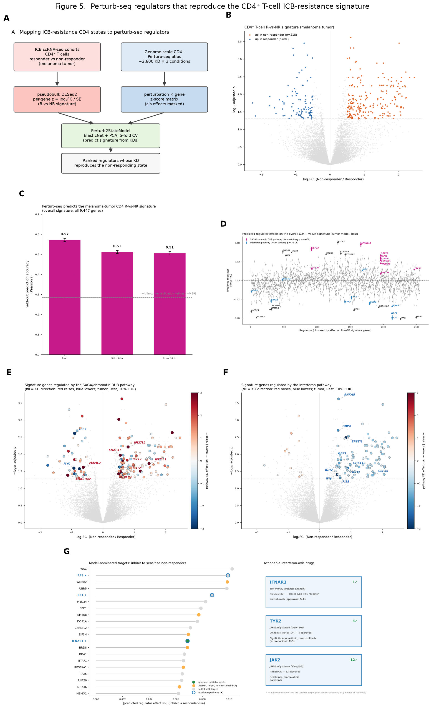

# Mapping the CD4⁺ T-cell ICB-resistance state to Perturb-seq regulators

A Figure-5-style reproduction of the genome-scale CD4⁺ Perturb-seq analysis,
reframed around a checkpoint-immunotherapy **responder-vs-non-responder (R-vs-NR)**
signature in melanoma. Instead of the source paper's young-vs-old "aging" signature,
we ask: **which CD4⁺ knockdowns reproduce the transcriptional state that separates
ICB non-responders from responders — and are any of them druggable?**



## Summary of findings

1. **The melanoma-tumor CD4⁺ resistance signature recapitulates known ICB-resistance biology.**
   The CD38⁺CD39⁺ T-eee exhaustion and cytotoxic-CD4 programs are up in
   non-responders; LEF1/TCF7/FOXP1 stem-memory is up in responders. In the
   volcano, 218 genes are up in non-responders and 91 up in responders.
2. **The healthy-donor Perturb-seq atlas predicts the tumor signature strongly.**
   Held-out cross-validation Pearson r = **0.57** (Rest), 0.51 (Stim 8 hr),
   0.51 (Stim 48 hr) — all above the within-tumor replication ceiling (r = 0.29).
3. **Two opposing pathways drive the axis.** The **interferon pathway** (IRF1/IRF9,
   IFNAR1) reproduces the *responder* state on knockdown; the **SAGA/chromatin-DUB
   pathway** (USP22/ATXN7L3/SGF29) reproduces *resistance*. They converge on the
   same shared cell-cycle/proliferation genes with opposite regulatory sign.
4. **The responder-reproducing axis is druggable.** The interferon/JAK-STAT targets
   map to approved compounds (anifrolumab for IFNAR1; JAK/TYK2 inhibitors such as
   ruxolitinib, baricitinib, upadacitinib) — a directly testable sensitization
   hypothesis for ICB non-responders.

See [`results/reports/summary.md`](results/reports/summary.md) for the full write-up
and [`results/reports/CD4_Perturbseq_Melanoma_ICB_Summary.docx`](results/reports/CD4_Perturbseq_Melanoma_ICB_Summary.docx)
for the formatted report.

## Repository layout

```
.
├── code/                               reproduction scripts (numbered by pipeline stage)
│   ├── 01_build_CD4_RvsNR_signature.py     per-cohort pseudobulk DESeq2 → per-gene z
│   ├── 02_fit_perturb2state_rank_regulators.py  fit Perturb2StateModel, rank regulators
│   ├── 03_prediction_metrics.py            held-out accuracy per condition
│   ├── 04_panelB_volcano.py                Panel B — R-vs-NR volcano
│   ├── 05_panelC_prediction.py             Panel C — prediction accuracy bars
│   ├── 06_panelD_regulator_effects.py      Panel D — predicted regulator effects
│   ├── 07_panelEF_pathway_regulated_genes.py  Panels E/F — pathway-regulated genes
│   └── 10_figure5_composite.py             assemble the 7-panel composite
├── results/
│   ├── figures/    figure5_composite.png + individual panels (A, B, C, D, E, F, G)
│   ├── tables/     signature, ranked regulators, prediction metrics, gene sets, metadata
│   └── reports/    summary.md + Word report + demo script
├── models/         pert2state_models.pkl (fitted models; ~41 MB)
├── requirements.txt
└── README.md
```

## Data availability

The melanoma ICB cohort is public:

| Cohort | Accession | Compartment | Platform | CD4 cells | Samples (R / NR) |
|---|---|---|---|---|---|
| Sade-Feldman melanoma | [GSE120575](https://www.ncbi.nlm.nih.gov/geo/query/acc.cgi?acc=GSE120575) | tumor | Smart-seq2 TPM | 5,391 | 43 (16 R / 27 NR) |

The genome-scale CD4⁺ Perturb-seq atlas (`GWCD4i.DE_stats`, ~2,600 knockdowns × 3
conditions) is a large public resource and is **not** redistributed here; the scripts
stream the required z-score layer directly. Raw inputs are excluded via `.gitignore`.

## Reproducing

```bash
python -m venv .venv && source .venv/bin/activate
pip install -r requirements.txt
pip install https://github.com/emdann/pert2state_model/archive/refs/heads/main.tar.gz
# scripts in code/ are numbered in pipeline order; run 01 → 10
```

The scripts were produced in a Python 3.11 conda environment; exact package versions
are pinned in `requirements.txt`.

## Method (brief)

- **Signature.** CD4⁺ cells isolated from the cohort, pseudobulked per patient, DESeq2
  non-responder-vs-responder; per-gene z-score = log₂FC / lfcSE.
- **Model.** `Perturb2StateModel` (ElasticNet + TruncatedSVD PCA, 5-fold CV) regressing
  the signature onto the perturbation matrix, per culture condition.

## Limitations

Single tumor cohort (within-cohort patient-split replication, not a second dataset);
the Perturb-seq atlas is from stimulated healthy-donor CD4⁺ cells and cannot capture
tumor-microenvironment signals; drug nominations are directional (correct target/direction),
not preclinical evidence of efficacy.

---

*Analysis and figures produced with Claude Science. Drug-target annotations were
retrieved from ChEMBL; gene-set enrichment used Enrichr.*
